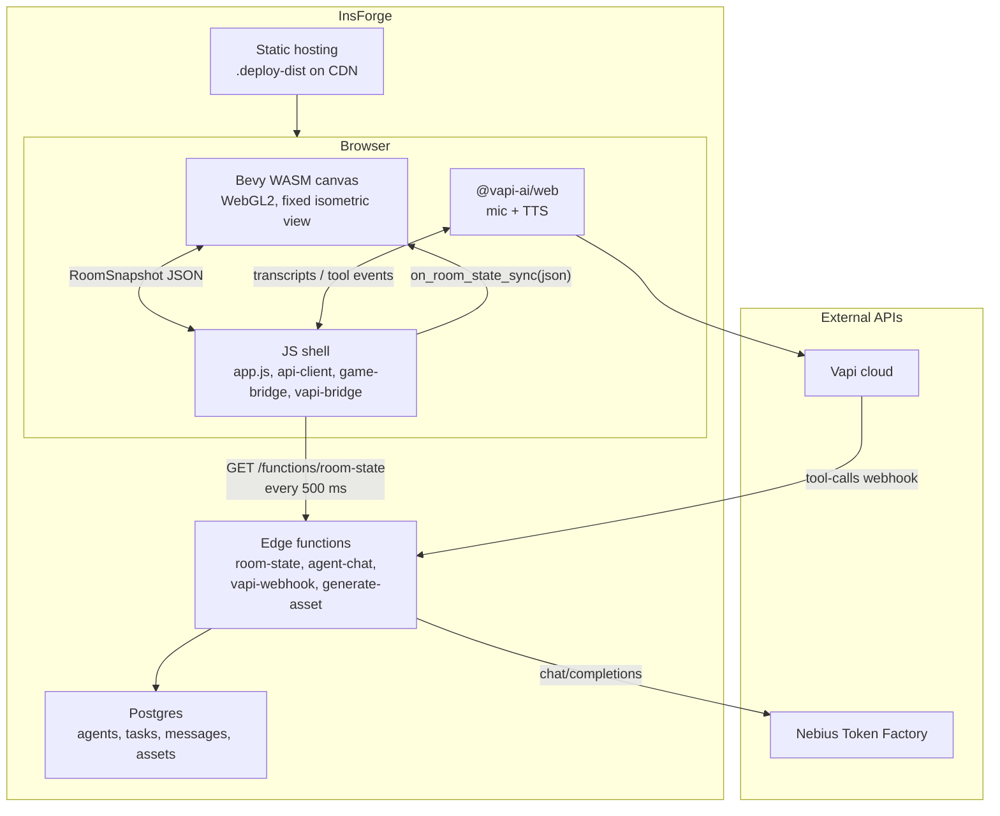

# Agent Space — Developer Overview

**As of 2026-06-21.** This is the primary onboarding doc: what the app is, how it is wired, where code lives, what works today, and what to do next. For step-by-step integration testing see [`INTEGRATION.md`](INTEGRATION.md). For the stretch-goal design see [`STRETCH.md`](STRETCH.md).

---

## What it is

**Agent Space** is a browser-based 3D hangout where four AI agents (Researcher, Coder, Planner, Social) live in a low-poly room. You talk to them via **Vapi** voice; their brains run on **Nebius** (OpenAI-compatible LLM) through **InsForge** edge functions; the **Bevy WASM** client renders avatars that walk, work, and talk based on polled room state.

**Judge demo flow (intended):**

1. Open the hosted URL → WASM loads → four Kenney avatars idle in stations.
2. Press **Start voice** → ask e.g. *"Hey Researcher, look into Rust WASM performance."*
3. Vapi → webhook → `agent-chat` → Nebius → DB update → 500 ms poll → Researcher walks to the research bench and enters **Working** / **Talking**.
4. Agent reply is spoken via Vapi TTS; avatar state syncs in the 3D view.

---

## Architecture & data flow



**Why JS + WASM split:** Vapi needs WebRTC/mic in the browser; Bevy owns the 3D scene. A thin JS layer polls backend state and pushes JSON into Rust via `wasm-bindgen`.

**Happy-path loop:**

| Step | Component | Action |
|------|-----------|--------|
| 1 | User | Speaks into mic |
| 2 | Vapi | STT + routes to tool (e.g. `talk_to_agent`, `assign_task`) |
| 3 | `vapi-webhook` | Validates secret, calls `agent-chat` or DB helpers |
| 4 | `agent-chat` | Nebius LLM → structured `{ speech, task? }` → writes messages/tasks, updates agent state |
| 5 | `room-state` | Returns `RoomSnapshot` (agents + tasks + optional `spawn_queue`) |
| 6 | `api-client.js` | Polls every 500 ms → `game-bridge.js` → `on_room_state_sync` |
| 7 | Bevy | Moves avatars, updates animation state, consumes `spawn_queue` primitives |

**Offline / demo resilience:** If polling fails, `canned-mode.js` cycles scripted mock snapshots. On localhost, **Alt+D** opens dev inject (keys **1–4** for idle/walking/working/mixed presets).

---

## Repository map

```
agent-space/
├── Cargo.toml                 # Workspace: game + protocol
├── rust-toolchain.toml        # Rust 1.89 + wasm32 target
├── .env.example               # All env var names (no secrets)
├── crates/
│   ├── protocol/              # Shared JSON types (Rust) — Track B
│   └── game/                  # Bevy WASM client — Track A
│       └── src/
│           ├── bridge.rs      # wasm-bindgen exports (room sync, speech)
│           ├── agent.rs       # Avatar spawn (Kenney glTF + capsule fallback)
│           ├── spawn_queue.rs # Stretch: spawn generated props in scene
│           └── …              # camera, movement, stations, animation, room sync
├── web/
│   ├── index.html             # Shell + Trunk copy-dir for js/ and assets/
│   ├── Trunk.toml             # WASM build hooks, dist = ../dist
│   └── js/
│       ├── app.js             # Boot, roster UI, poll loop
│       ├── api-client.js      # room-state fetch
│       ├── game-bridge.js     # WASM export glue
│       ├── vapi-bridge.js     # Inline assistant + tools
│       ├── canned-mode.js     # Offline scripted states
│       └── dev-inject.js      # Localhost mock injector
├── insforge/
│   ├── schema.sql             # agents, tasks, messages, assets
│   ├── seed.sql               # 4 agents, nebius backend
│   ├── dev-server.ts          # Local Deno router (port 8787)
│   └── functions/
│       ├── _shared/           # protocol.ts, db.ts, nebius.ts, cors, mock
│       ├── room-state/        # GET RoomSnapshot
│       ├── agent-chat/        # POST → Nebius → AgentTurn
│       ├── vapi-webhook/      # Vapi tool routing
│       └── generate-asset/    # Stretch: text → primitive spec
├── assets/
│   ├── characters/*.glb       # Kenney Blocky Characters (embedded textures)
│   ├── environment/           # Station props (OBJ/MTL)
│   └── manifest.json          # agent_id → gltf path + animation names
├── scripts/
│   ├── prepare-deploy-bundle.sh  # dist → .deploy-dist (gzip wasm)
│   └── deploy-vercel.json        # Headers + SPA rewrite for CDN
└── docs/
    ├── OVERVIEW.md            # ← you are here
    ├── INTEGRATION.md         # Manual E2E checklist
    └── STRETCH.md             # Multimodal asset generation design
```

---

## Shared protocol contract

**Rule:** All tracks use the same JSON shapes. Rust defines them in `crates/protocol/src/lib.rs`; TypeScript mirrors them in `insforge/functions/_shared/protocol.ts`. Do not invent alternate field names or enums.

Core types:

| Type | Purpose |
|------|---------|
| `RoomSnapshot` | `{ agents[], tasks[], spawn_queue? }` — returned by `room-state`, consumed by Bevy + JS |
| `AgentSnapshot` | `{ id, name, role, state, station_id, x, y, backend }` |
| `AgentState` | `idle` \| `walking` \| `working` \| `talking` (snake_case everywhere) |
| `AgentTurn` | `{ speech, task? }` — LLM output from `agent-chat` |
| `TaskAction` | `{ type, station }` — optional task assignment |
| `SpawnQueueEntry` | Stretch: generated asset to spawn in Bevy (`render`, `status`, `x`, `y`) |

Round-trip tests: `cargo test -p protocol` (7 tests).

---

## Remote services & connections

| Service | Role | Code that talks to it | URL / endpoint | Env var(s) |
|---------|------|----------------------|----------------|------------|
| **InsForge** | Postgres, edge functions, static hosting, secrets | `insforge/functions/*`, browser poll | API: `https://6ns446hp.us-west.insforge.app`<br>CDN: `https://6ns446hp.insforge.site` | `INSFORGE_API_KEY` (CLI)<br>`VITE_INSFORGE_URL` (browser)<br>Auto-injected in deploy: `INSFORGE_BASE_URL`, `ANON_KEY`, `SERVICE_ROLE_KEY` |
| **Nebius** | Agent reasoning (primary LLM) | `_shared/nebius.ts` in `agent-chat` | `https://api.tokenfactory.nebius.com/v1/` | `NEBIUS_API_KEY` (secrets only) |
| **OpenRouter** | LLM fallback if Nebius unset | `_shared/openrouter.ts` | `https://openrouter.ai/api/v1` | `OPENROUTER_API_KEY` |
| **Vapi** | Voice STT/TTS + tool orchestration | `web/js/vapi-bridge.js` (client), `vapi-webhook` (server) | Vapi cloud + your webhook URL | `VITE_VAPI_PUBLIC_KEY` (browser)<br>`PRIVATE_VAPI_API_KEY` / `VAPI_API_KEY` (webhook auth) |

**Hosting nuance:** Deploy uses `npx @insforge/cli deployments deploy .deploy-dist`. InsForge serves the bundle via a **Vercel-backed CDN**; `scripts/deploy-vercel.json` supplies gzip-WASM headers and SPA rewrites. Deploy **`.deploy-dist/`**, not raw `./dist/` (raw WASM ~29 MB hits upload limits and lacks gzip headers).

---

## Running locally

### Prerequisites

- Rust **1.89+** (`rust-toolchain.toml`, includes `wasm32-unknown-unknown`)
- Trunk **0.21.14**: `cargo install --locked trunk --version 0.21.14`
- Node 20+ (for `web/` Vapi SDK bundle)
- Deno 1.40+ (for edge functions): `curl -fsSL https://deno.land/install.sh | sh`

### Client (3D room)

```bash
cp .env.example .env   # set VITE_INSFORGE_URL, VITE_VAPI_PUBLIC_KEY as needed
cd web
npm install
npm run build
env -u NO_COLOR trunk serve   # NO_COLOR=1 breaks Trunk 0.21.14 in some shells
```

Open `http://127.0.0.1:8080`. Splash hides when WASM boots.

### Backend (edge functions)

```bash
cd insforge
export PATH="$HOME/.deno/bin:$PATH"
deno task check
deno task dev    # http://127.0.0.1:8787
```

Without `SERVICE_ROLE_KEY`, functions use the **in-memory mock** (`_shared/mock.ts`) — fine for UI dev, not for testing real DB writes.

Point the client at local backend:

```bash
export VITE_INSFORGE_URL=http://127.0.0.1:8787
cd web && npm run build && env -u NO_COLOR trunk serve
```

### Voice (optional)

```bash
vapi listen --forward-to http://127.0.0.1:8787/functions/vapi-webhook
```

Requires `VITE_VAPI_PUBLIC_KEY` in `.env` and a valid Vapi public key after rebuild.

---

## How to use the app

| UI element | Behavior |
|------------|----------|
| **Canvas** | Bevy 3D room — four Kenney avatars at research/code/meet/lounge stations |
| **Agents sidebar** | Name, role, state badge (Idle/Walking/Working/Talking), backend label |
| **Start voice** | Starts Vapi session (needs `VITE_VAPI_PUBLIC_KEY`) |
| **Canned mode** | Auto-enables when `room-state` poll fails; cycles mock states every 4 s |
| **Dev inject** (localhost) | **Alt+D** → panel; keys **1–4** inject idle/walking/working/mixed |

**Example voice commands:** see README “Judge demo script” — e.g. *"What's going on in the room?"*, *"Hey Researcher, look into Rust WASM performance."*, *"Send Coder to the code station."*

---

## Current status: what works vs. implied

Honest capability matrix as of the latest audit and fixes:

| Capability | Status | Notes |
|------------|--------|-------|
| Workspace builds (native + wasm32) | ✅ Verified | `cargo check`, `cargo test -p protocol` (7/7), `trunk build --release` |
| Client boots & renders in browser | ✅ Verified | 3D room, station props, roster, canned mode, dev inject |
| Kenney glTF avatars (4 distinct skins) | ✅ Verified | Textures embedded in `.glb`; renders on WebGL2 |
| glTF animations per agent state | ✅ Implemented | idle/walk/work clips bound when glTF loads |
| `spawn_queue` → Bevy primitives | ✅ Implemented | Idempotent spawn by `asset_id`; needs live `generate-asset` to see visually |
| Protocol Rust ↔ TS mirror | ✅ Verified | Field/casing match; round-trip tests pass |
| Edge functions (room-state, agent-chat, webhook, generate-asset) | ✅ Implemented | `deno task check` passes; mock mode when no DB |
| InsForge `insert([{...}])` DB writes | ✅ Fixed in code | **Needs live DB smoke test** with `SERVICE_ROLE_KEY` |
| Nebius LLM responses | 🔶 Creds available | Code complete; live per-role chat validation in progress |
| Vapi voice (mic → TTS) | 🔶 Needs human | Client config present; full loop requires mic + live session |
| Cloud deploy (`.deploy-dist`) | 🔶 Documented | Scripts + README; needs `insforge deployments deploy` with keys |
| Stretch: InsForge storage bucket (H2) | ❌ Not started | |
| Stretch: real image/mesh generation (H3) | 🔶 Partial | Text → primitive spec only today |

**Legend:** ✅ verified in this repo · 🔶 implemented but not fully live-tested · ❌ not started

---

## Gaps & next natural steps

Prioritized for continuing the hackathon / demo:

1. **Live E2E with real creds** — Run `deno task dev` with `NEBIUS_API_KEY`, `SERVICE_ROLE_KEY`, and InsForge DB; confirm `agent-chat` writes messages/tasks and `room-state` reflects state changes. Exercise Vapi webhook tools via curl or `vapi listen`.
2. **Human mic test** — `VITE_VAPI_PUBLIC_KEY` + deployed or tunneled webhook; confirm TTS and **Talking** state in Bevy.
3. **Cloud deploy** — `bash scripts/prepare-deploy-bundle.sh` → `npx @insforge/cli deployments deploy .deploy-dist` with deployment env vars set.
4. **Stretch end-to-end** — Voice *"add a whiteboard"* → `request_custom_item` → `generate-asset` → `spawn_queue` entry with `status: ready` → visible primitive in scene (H5 + H4 path exists; confirm with live Nebius).
5. **H2 / H3** — InsForge storage bucket + real asset generation pipeline if time allows (see `STRETCH.md`).
6. **G3 integration sign-off** — Walk through `docs/INTEGRATION.md` and replace self-reported “Yes” entries with dated evidence.

---

## Related docs

- [`README.md`](../README.md) — Quick start, deployment commands, judge demo script
- [`INTEGRATION.md`](INTEGRATION.md) — Manual integration checklist (G3)
- [`STRETCH.md`](STRETCH.md) — Multimodal on-demand assets (Track H)
- [`insforge/README.md`](../insforge/README.md) — Backend / Deno dev server details
- [`.cursor/plans/agent_space_wasm_bevy_4e126240.plan.md`](../.cursor/plans/agent_space_wasm_bevy_4e126240.plan.md) — Full build plan + audit history (implementation status YAML)
