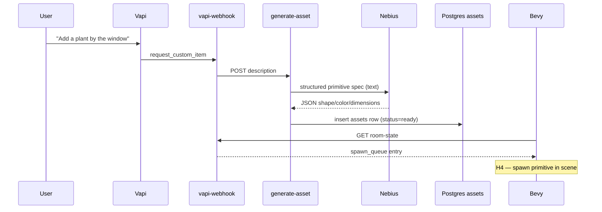

# Stretch Track H — On-Demand Asset Generation

Foundation for voice-driven custom props in Agent Space. This track adds protocol types, a Nebius-backed generation stub, and Vapi wiring. Full 3D mesh generation and Bevy hot-load are follow-ups (H2–H5).

## Goal

Users can say things like *“Add a whiteboard by the meeting table”* or *“Bring a plant by the window.”* The backend queues a spawn entry; Bevy polls `room-state` and eventually renders the item.

**MVP render path:** textured **primitives** (cuboid / sphere / capsule + color metadata). No glTF mesh pipeline yet.

## Architecture



## Protocol (`spawn_queue`)

`RoomSnapshot` now includes an optional `spawn_queue` array (empty by default for backward compatibility).

| Type | Purpose |
|------|---------|
| `AssetKind` | `prop` \| `clothing` \| `furniture` |
| `AssetStatus` | `generating` \| `ready` \| `failed` |
| `PrimitiveShape` | `cuboid` \| `sphere` \| `capsule` |
| `AssetRenderSpec` | tagged union: `{ mode: "primitive", ... }` or `{ mode: "gltf", url }` |
| `SpawnQueueEntry` | asset metadata + world position `(x, y)` |

Rust definitions live in `crates/protocol/src/lib.rs`. TypeScript mirror: `insforge/functions/_shared/protocol.ts`.

### Example `spawn_queue` entry

```json
{
  "asset_id": "550e8400-e29b-41d4-a716-446655440000",
  "kind": "prop",
  "description": "potted plant",
  "status": "ready",
  "requested_by": "agent-researcher",
  "render": {
    "mode": "primitive",
    "shape": "cuboid",
    "color": "#2d5016",
    "width": 0.4,
    "height": 0.8,
    "depth": 0.4
  },
  "x": 0,
  "y": 0
}
```

Primitive render specs are persisted in `assets.gltf_path` as JSON until a real glTF URL exists.

## Database

`insforge/schema.sql` defines the `assets` table:

| Column | Notes |
|--------|-------|
| `kind` | prop / clothing / furniture |
| `description` | human-readable label |
| `storage_url` | future PNG / glTF in InsForge Storage |
| `gltf_path` | JSON `AssetRenderSpec` (foundation) or glTF path (later) |
| `requested_by` | optional `agents.id` |
| `status` | generating / ready / failed |

`room-state` returns assets with `status = ready` in `spawn_queue`.

## Edge functions

### `POST /functions/generate-asset`

**Body:**

```json
{
  "description": "whiteboard for the meeting table",
  "kind": "prop",
  "requested_by": "agent-planner",
  "x": 0,
  "y": 0
}
```

**Behavior (foundation stub):**

1. Calls Nebius for a structured JSON spec (shape, color, dimensions, confirmation speech).
2. Falls back to canned metadata when `NEBIUS_API_KEY` is unset.
3. Inserts an `assets` row (or mock queue entry offline).
4. Returns `{ ok, asset_id, spawn, speech }`.

No image generation or Storage upload in this phase.

### `POST /functions/vapi-webhook` — `request_custom_item`

Vapi tool schema is in `web/js/vapi-bridge.js`. The webhook forwards to `generate-asset` and returns `{ ok, asset_id, speech, spawn }` to the assistant.

| Parameter | Required | Description |
|-----------|----------|-------------|
| `description` | yes | Natural-language item request |
| `requested_by_agent` | no | Agent id |
| `kind` | no | `prop`, `clothing`, or `furniture` |

## Local development

```bash
cd insforge && deno task dev
```

```bash
# Direct generation
curl -s -X POST http://127.0.0.1:8787/functions/generate-asset \
  -H 'Content-Type: application/json' \
  -d '{"description":"red couch for the lounge"}' | jq

# Room state includes spawn_queue
curl -s http://127.0.0.1:8787/functions/room-state | jq '.spawn_queue'

# Via Vapi webhook stub
curl -s -X POST http://127.0.0.1:8787/functions/vapi-webhook \
  -H 'Content-Type: application/json' \
  -d '{
    "message": {
      "type": "tool-calls",
      "toolCallList": [{
        "id": "call-1",
        "function": {
          "name": "request_custom_item",
          "arguments": {"description": "desk lamp on the coding desk"}
        }
      }]
    }
  }' | jq
```

## Deploy

```bash
npx @insforge/cli functions deploy generate-asset \
  --file insforge/functions/generate-asset/index.ts \
  --name "Generate Asset"
```

Redeploy `vapi-webhook` and `room-state` after protocol changes.

## Remaining work (H2–H5)

| Task | Description |
|------|-------------|
| **H2** | InsForge Storage bucket + signed URL helper for textures / glTF |
| **H3** | Nebius image model → PNG upload; optional external mesh API |
| **H4** | Bevy runtime spawn from `spawn_queue` (primitive first, glTF second) |
| **H5** | End-to-end voice demo + consumed/spawned asset lifecycle |

## Related files

- `crates/protocol/src/lib.rs` — Rust protocol types
- `insforge/functions/_shared/protocol.ts` — TS mirror
- `insforge/functions/generate-asset/index.ts` — generation stub
- `insforge/functions/vapi-webhook/index.ts` — `request_custom_item` handler
- `web/js/vapi-bridge.js` — Vapi tool schema
- `insforge/schema.sql` — `assets` table
